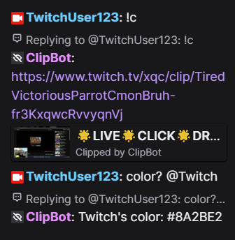

# 🎬 ClipBot — Twitch Chatbot 🤖

[](https://www.python.org/)
[](LICENSE)
[](https://twitch.tv)
[](#)

**ClipBot** is a lightweight Twitch chatbot built with Python.  
It listens to chat messages, logs them to a database, and supports fun, useful commands such as **clip creation** and **color lookup**.

---

## 📑 Contents
- [Motivation](#-motivation)
- [Features](#-features)
- [Setup](#-setup)
- [OAuth Token](#-oauth-token)
- [Usage](#-usage)
- [File Structure](#-file-structure)
- [Technologies](#-technologies)
- [Demo](#-demo)
- [Future Work](#-future-work)
- [License](#-license)

## 🧩 Motivation

Twitch offers many tools for streamers, but creating clips directly from chat or adding fun utilities often requires third-party solutions.  
I built **ClipBot** to solve this problem by giving streamers and their communities a lightweight chatbot that can:

- 📸 Instantly create clips with a simple `!clip` command.  
- 🎨 Provide quick color lookups (`!color`) with support for both English and Arabic.  
- 📂 Keep a record of all chat messages in an easy-to-query SQLite database.  

During development, I faced challenges with Twitch’s OAuth authentication and API rate limits.  
I solved this by ensuring the bot requests only the necessary scopes (`chat:edit`, `chat:read`, `clips:edit`) and by handling API calls efficiently.  

This project started as a personal experiment, but I decided to share it publicly to help others and showcase my software engineering skills.

---

## ✨ Features

- ✅ Multi-channel support  
- 💾 Chat logging to **SQLite**  
- 🔗 Twitch API integration (**Helix**)  
- ⚡ Commands: `!clip`, `!color` (with English & Arabic aliases)  
- 💡 Natural triggers: `clip?`, `color?` (and Arabic equivalents)  
- ⚙️ Easy configuration via `.env` file  

---

## 🚀 Setup

1. **Clone the repository**

   ```sh
   git clone https://github.com/m7mdxyz/ClipBot.git
   cd ClipBot
   ```


2. **Install dependencies**

   ```sh
   pip install -r requirements.txt
   ```

3. **Configure environment variables**
   Create a `tokens.env` file and add your Twitch API credentials:

   ```ini
   TWITCH_CLIENT_ID=your_client_id
   TWITCH_CLIENT_SECRET=your_client_secret
   TWITCH_OAUTH_TOKEN=your_oauth_token
   CHANNELS=channel1,channel2
   ```

4. **Run the bot** 🎉

   ```sh
   python bot.py
   ```

---

## 🔑 OAuth Token

Make sure your **OAuth token** has the following scopes:

```
chat:edit
chat:read
clips:edit
```
**Without these scopes, the bot won’t be able to read chat, send messages, or create clips.**

You can generate tokens with these scopes using tools like [Twitch Token Generator](https://twitchtokengenerator.com/) or directly via Twitch’s API.

---

## 💡 Usage

* Type `!clip` or `!color` in Twitch chat to trigger bot actions
* Natural triggers like `clip?` / `color?` also work
* All chat messages are automatically logged into **`chat_logs.db`**

---

## 📂 File Structure

```
.
├── bot.py                # Main bot logic & command handling
├── twitch_api_handler.py # Twitch API integration
├── tokens.env            # Credentials & config
├── requirements.txt      # Python dependencies
└── chat_logs.db          # SQLite database (auto-generated)
```

---

## 🛠️ Technologies

* 🐍 [Python 3.10+](https://www.python.org/)
* 🎥 [twitchAPI](https://pypi.org/project/twitchAPI/)
* 🗄️ [SQLAlchemy](https://www.sqlalchemy.org/)
* 🌐 [Requests](https://pypi.org/project/requests/)
* 🔑 [python-dotenv](https://pypi.org/project/python-dotenv/)

---

## 📸 Demo

Example of ClipBot responding to Twitch chat commands:



---

## 🔮 Future Work 

- Add more Twitch commands (polls, timers, shoutouts)  
- Custom commands (streamers can create their own `!commands`)  
- Command cooldowns and permissions (e.g., mods only, viewer limits)  
- Discord integration (send clips or chat highlights to a Discord server)  
- Web dashboard for visual configuration and management

---

## 📜 License

Licensed under the **MIT License** ✅

